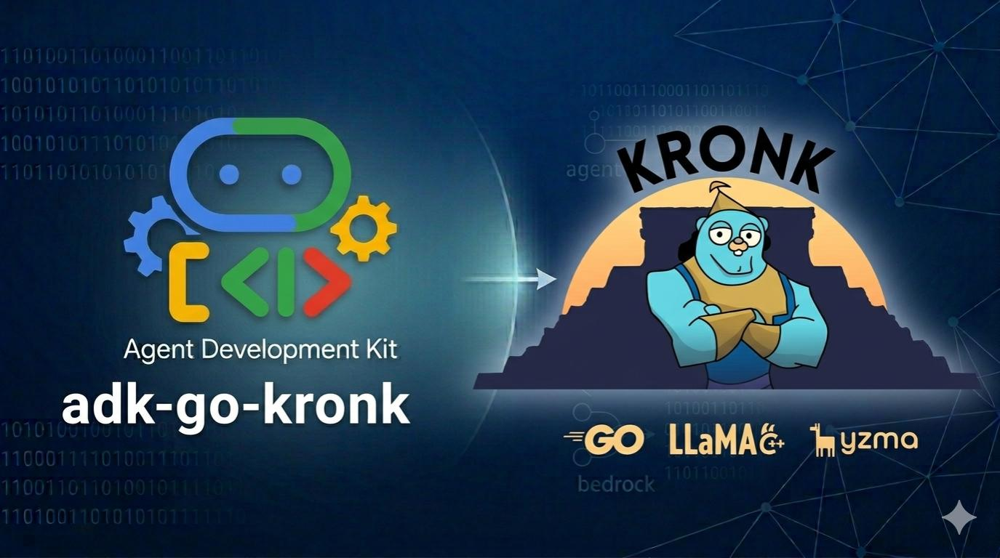

<p align="center">
  
</p>

# adk-go-kronk

[kronk](https://github.com/ardanlabs/kronk) implementation of the [`model.LLM`](https://pkg.go.dev/google.golang.org/adk/model#LLM) interface for [adk-go](https://github.com/google/adk-go), so you can run agents on any Kronk-supported local GGUF model with the same ADK APIs you use for Gemini.

**Other providers:** [adk-go-bedrock](https://github.com/craigh33/adk-go-bedrock) · [adk-go-ollama](https://github.com/craigh33/adk-go-ollama)

## Requirements

- **Go** 1.26+ (aligned with `google.golang.org/adk`)
- Enough disk space and (optionally) GPU for the selected GGUF model. The first run of any Kronk-backed program downloads the llama.cpp libraries, the Kronk model catalog, and the chosen model into Kronk's default install directories; subsequent runs reuse the cached artifacts. See the [Kronk README](https://github.com/ardanlabs/kronk#readme) for platform / GPU support.

## Install

```bash
go get github.com/craigh33/adk-go-kronk
```

Replace the module path with your fork or published path if you rename the module in `go.mod`.

## Usage

```go
ctx := context.Background()

llm, err := kronk.New(ctx, kronk.Config{
    ModelFiles: []string{"/path/to/model.gguf"},
})
if err != nil {
    log.Fatal(err)
}
defer llm.Close(ctx)

a, err := llmagent.New(llmagent.Config{
    Name:        "assistant",
    Description: "A helpful assistant running on a local Kronk model",
    Model:       llm,
    Instruction: "You reply briefly and clearly.",
})
if err != nil {
    log.Fatal(err)
}

// Wire `a` into runner.New(...), a launcher, or call
// llm.GenerateContent(ctx, req, stream) directly.
```

The provider implements [`model.LLM`](https://pkg.go.dev/google.golang.org/adk/model#LLM) on top of a loaded [`*kronk.Kronk`](https://pkg.go.dev/github.com/ardanlabs/kronk/sdk/kronk#Kronk) engine. The convenience constructor `kronk.New` owns the engine lifecycle; use `kronk.NewWithKronk` if you already have an engine you want to reuse.

The [`internal/mappers`](internal/mappers/) package holds genai ↔ Kronk conversions (requests, responses, tools, usage); the public provider surface is [`kronk`](kronk/).

### Model files

`Config.ModelFiles` is the slice of GGUF paths the Kronk engine will load. The easiest way to obtain them is via Kronk's own catalog / models helpers, for example:

```go
mdls, _ := models.New()
mp, _ := ctlg.DownloadModel(ctx, krnk.FmtLogger, "Qwen3-0.6B-Q8_0")
llm, _ := kronk.New(ctx, kronk.Config{ModelFiles: mp.ModelFiles})
```

See [`examples/kronk-web-ui`](examples/kronk-web-ui) for a complete runnable example including library and model installation.

## Examples

Each example has its own `README.md` and `Makefile`:

- [`examples/kronk-web-ui`](examples/kronk-web-ui): ADK local web UI + REST API launcher backed by a Kronk-loaded GGUF model. Controlled via `KRONK_MODEL_ID` (catalog model ID, default `Qwen3-0.6B-Q8_0`) or `KRONK_MODEL_URL` (direct GGUF URL). First run downloads the llama.cpp libraries, the Kronk catalog, and the selected model; subsequent runs reuse the cache.

```bash
export KRONK_MODEL_ID=Qwen3-0.6B-Q8_0
make -C examples/kronk-web-ui run
```

## How it maps to Kronk

- **Messages**: `genai` roles `user` and `model` map to Kronk `user` and `assistant`. `FunctionResponse` parts are emitted as standalone `role:"tool"` messages with `tool_call_id` so Kronk can thread them back to the originating tool call.
- **System instruction**: `GenerateContentConfig.SystemInstruction` is prepended as a `role:"system"` message.
- **Inference params**: `Temperature`, `TopP`, `TopK`, `MaxOutputTokens`, `StopSequences`, `Seed`, `FrequencyPenalty`, and `PresencePenalty` are passed through to Kronk.
- **Tools**: only `genai.Tool.FunctionDeclarations` are mapped (as OpenAI-shaped function tool entries with lowercased JSON Schema types). Non-function variants (Google Search, Code Execution, Retrieval, MCP servers, Computer Use, File Search, Google Maps, URL Context, etc.) are rejected early with a clear provider error. Use ADK's [`mcptoolset`](https://pkg.go.dev/google.golang.org/adk/tool/mcptoolset) to bring MCP tools in as function declarations.
- **Multimodal input**: inline `image/*`, `audio/*`, and `video/*` bytes on user turns are sent as OpenAI-style `image_url` / `input_audio` / `video_url` blocks. Remote `FileData` URIs and inline media on model turns are rejected — inline the bytes on the user turn instead.
- **Streaming**: when streaming is enabled the provider calls `ChatStreaming`, emits text deltas as `Partial:true` responses, and buffers tool calls, reasoning, usage, and finish reason into the final `TurnComplete:true` response.
- **Usage**: Kronk `Usage` maps to ADK `GenerateContentResponseUsageMetadata` (`PromptTokenCount`, `CandidatesTokenCount`, `TotalTokenCount`).

## Limitations

- **No native safety / guardrails**: ADK `SafetySettings` and `ModelArmorConfig` are not supported; Kronk runs local models with no built-in guardrail layer. Wrap the provider with your own policy layer if you need one.
- **Non-function tool variants unsupported**: Only function declarations are passed through to the model. All other `genai.Tool` variants return a request-time error with a clear message naming the unsupported variants.
- **Model-role media unsupported**: Only text, reasoning, and tool-call parts are permitted on assistant (`model`-role) turns. Inline or remote media on assistant turns will produce an error.
- **Remote `FileData` unsupported**: Kronk loads local models and does not fetch arbitrary remote URIs; callers must inline bytes via `InlineData`.
- **Default request timeout**: Kronk's `Chat` / `ChatStreaming` APIs require a context deadline. When the caller does not provide one the provider attaches a 2-minute default — override it with `context.WithTimeout` for long-running prompts.
- **No embeddings / rerank surface**: ADK `model.LLM` is chat-only; call the underlying `*kronk.Kronk` directly (via `Model.Engine()`) for embedding or rerank features if you need them.

## Contributing

See [CONTRIBUTING.md](CONTRIBUTING.md) for Makefile targets, required pre-commit setup, commit message conventions, and pull request guidelines. For new issues, use the [bug report](https://github.com/craigh33/adk-go-kronk/issues/new?template=bug_report.yml) or [feature request](https://github.com/craigh33/adk-go-kronk/issues/new?template=feature_request.yml) templates.

## License

Apache 2.0 — see [LICENSE](LICENSE).

[Contributing](CONTRIBUTING.md) · [Issues](https://github.com/craigh33/adk-go-kronk/issues) · [Security](https://github.com/craigh33/adk-go-kronk/security)
